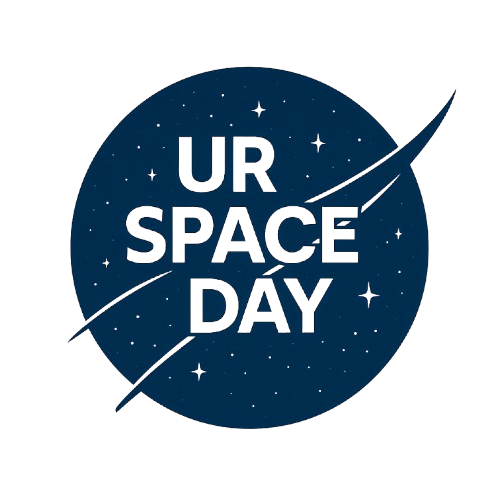

<h1 align="center">UR SPACE DAY 🚀</h1>

<div align="center">
  
</div>

<hr>

## 📖 About the Project
This is an **open-source project** aimed at interactivity and the discovery of photos from our cosmos, powered by the [NASA APOD API](https://api.nasa.gov/).  
Feel free to explore, use, and contribute! 
---

## Link to the website : 
<div>
<a href="https://check-ur-space-day.vercel.app/"
   target="_blank"
   rel="noopener noreferrer"
   title="Acesse o projeto CHECK UR SPACE DAY">
  
</a>
</div>

---

## ✨ Features
- 🔭 View daily astronomy images from NASA  
- 📅 Search by specific date  
- 📱 Responsive design for desktop and mobile  
- 🌌 Click to zoom and see details about each image  

---

## 🛠️ Technologies Used
- **HTML5** + **CSS3** + **JavaScript**  
- **NASA APOD API** for space images  
- Open Source License: **MIT**  

---

## 🚀 How to Run Locally
1. **Clone the repository**  
   ```bash
   git clone https://github.com/YourUser/YourRep.git

---
